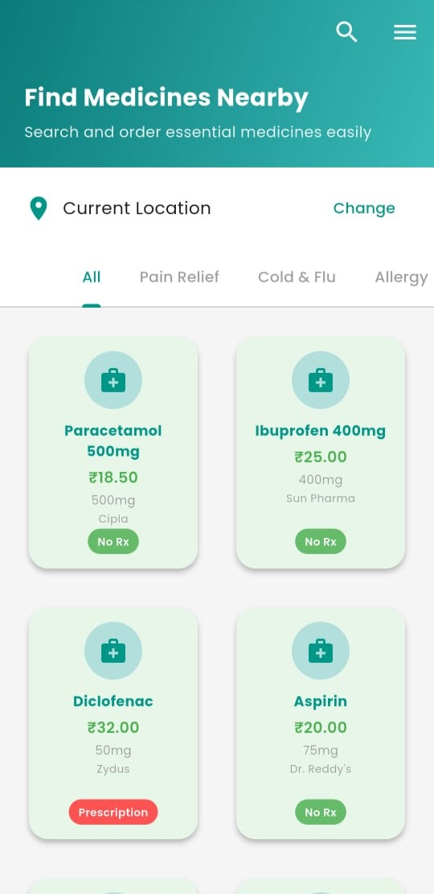
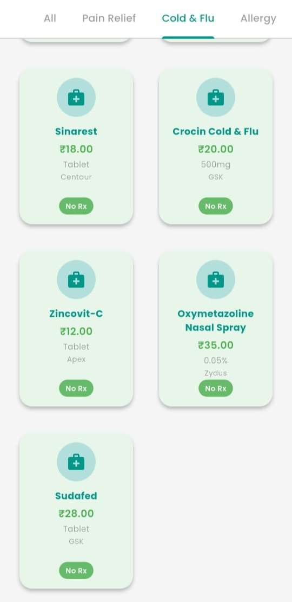
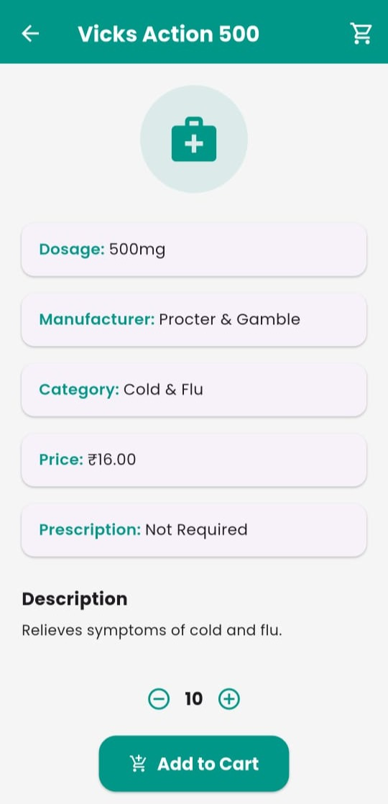
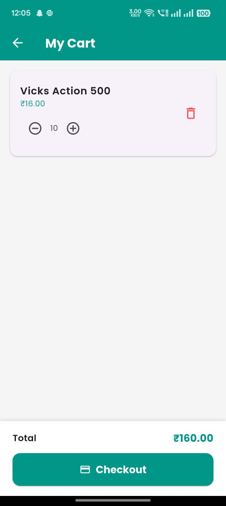
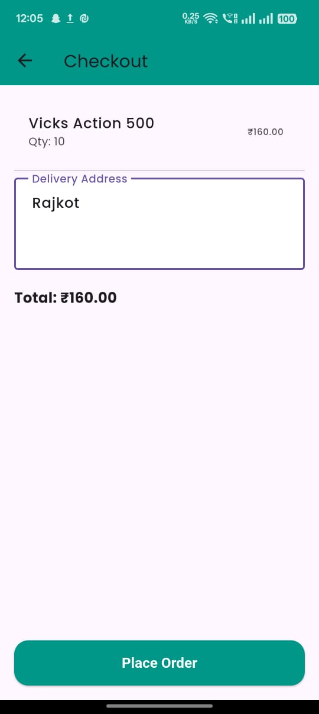
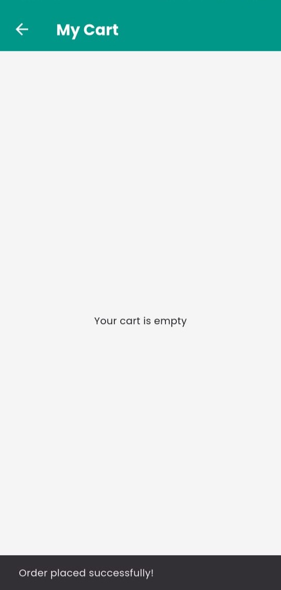
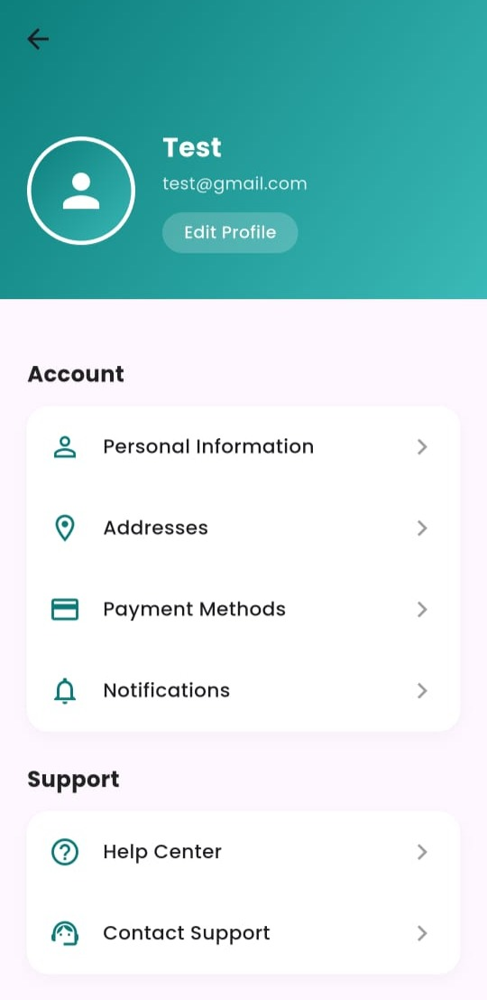
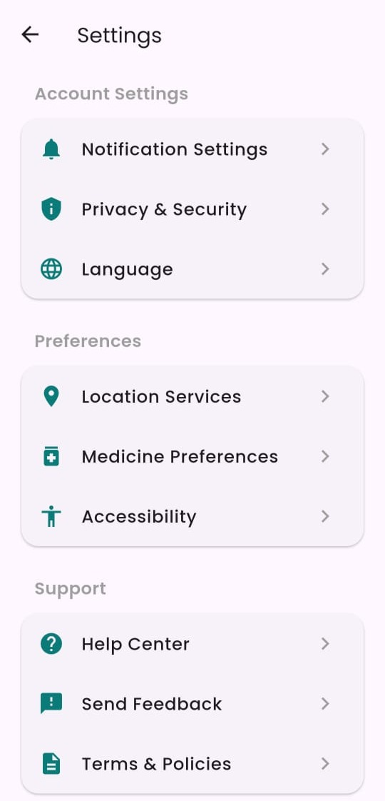

# 💊 PharmaFinder

**PharmaFinder** is a Flutter-based mobile application that helps users locate nearby medical stores and search for medicines. It also includes an admin panel (PharmaFinderAdmin) for medical shop owners to manage their store inventory and process user orders.

---

## 📱 Features

### 👤 User App (PharmaFinder)
- 🔍 Search for medicines by name or category
- 📍 Locate nearby medical stores based on location
- 🛒 View medicine details and add to cart
- 📦 Place orders directly from the app
- 🧭 Interactive map for medical store locations
- 🧾 Filter medicines by categories

### 🧑‍💼 Admin App (PharmaFinderAdmin)
- 🏪 Register medical stores
- 📦 Add, edit, and delete medicines from inventory
- 📃 View and manage user orders
- 📊 Dashboard with store insights and inventory data

---

## 🛠️ Tech Stack

- **Frontend:** Flutter
- **Backend:** Firebase Realtime Database & Firestore
- **Authentication:** Firebase Auth
- **Storage:** Firebase Cloud Storage
- **Location:** Geolocation APIs
- **State Management:** setState (initial), Riverpod/GetX (optional for future)
  
---

## 🧠 Future Enhancements

- 🔔 Push notifications for order updates
- 📸 Prescription upload feature
- 🌐 Multi-language support
- 💳 In-app payment integration

---

## 🙋‍♂️ Author

Made with 💙 by **Dhairya Dudakiya**

- [GitHub](https://github.com/Dhairya-Dudakiya)
- [LinkedIn](https://www.linkedin.com/in/dhairya-dudakiya)
- [Email](mailto:dhairyadudakiya52056@gmail.com)

---

## 📸 Screenshots

| Splash | Home | Categories |
|--------|------|------------|
|  |  |  |

| Medicine Details | Cart | Checkout |
|------------------|------|----------|
|  |  |  |

| Cart After Checkout | Profile | Settings |
|---------------------|---------|----------|
|  |  |  |

